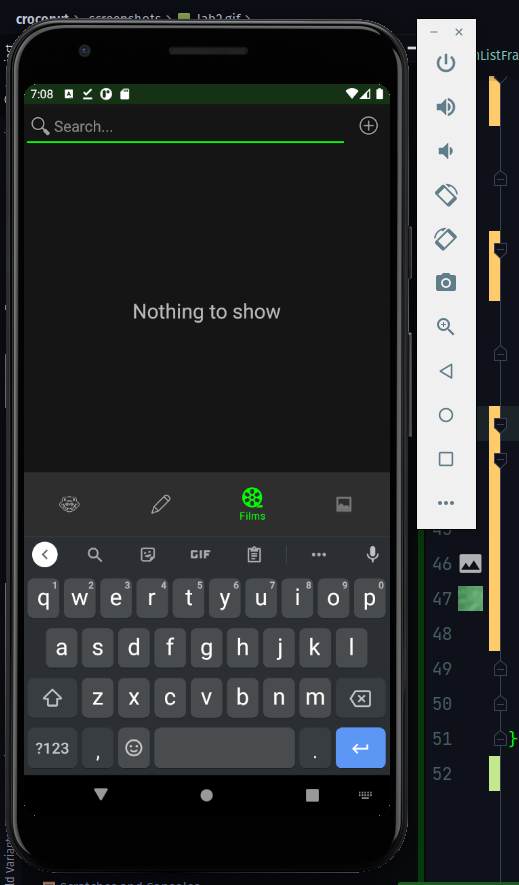
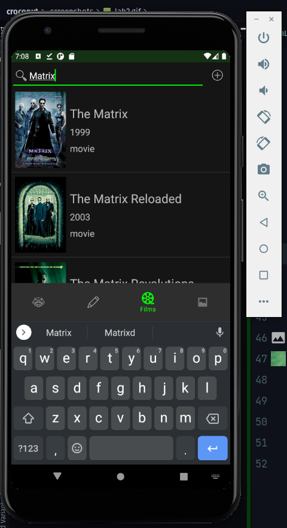
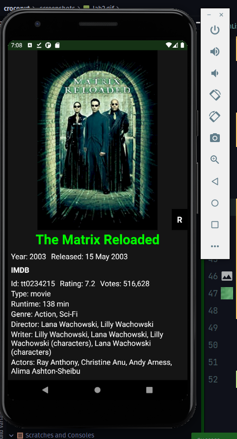
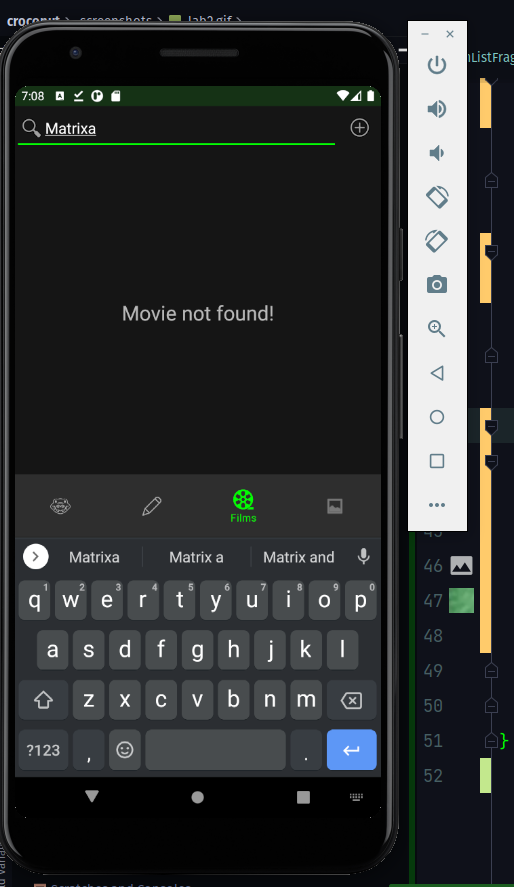
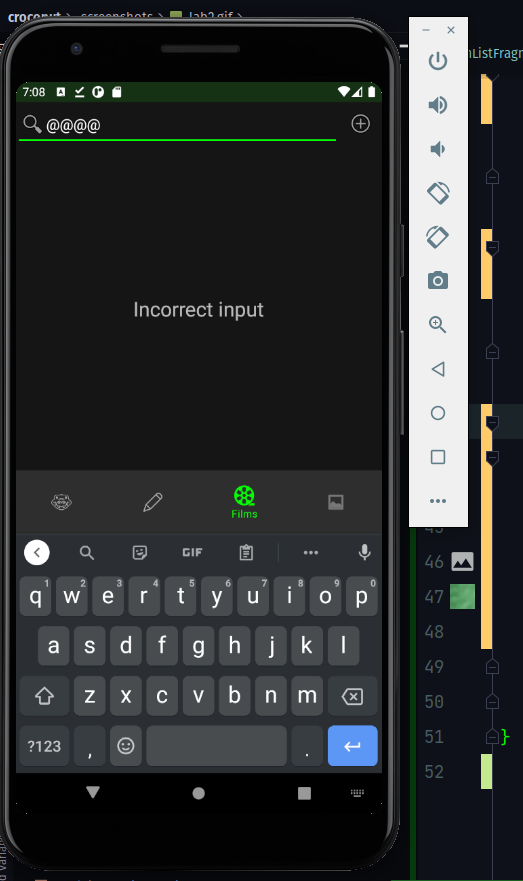
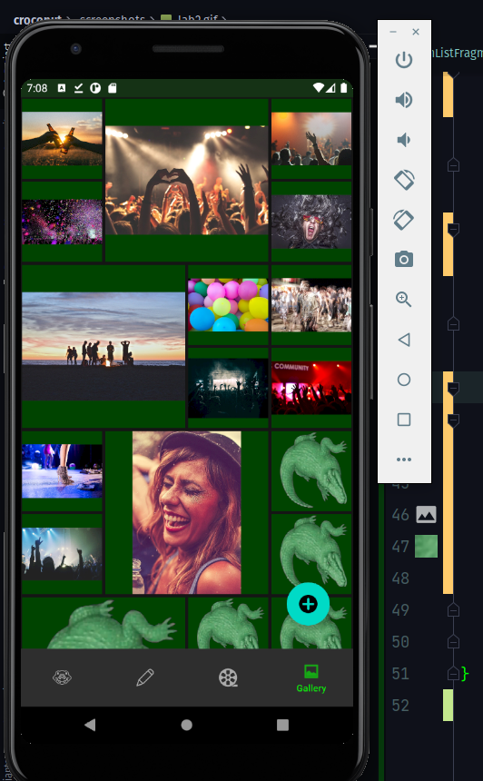

### НАЦІОНАЛЬНИЙ ТЕХНІЧНИЙ УНІВЕРСИТЕТ УКРАЇНИ "КИЇВСЬКИЙ ПОЛІТЕХНІЧНИЙ ІНСТИТУТ ІМЕНІ ІГОРЯ СІКОРСЬКОГО" Факультет інформатики та обчислювальної техніки Кафедра обчислювальної техніки

## Лабораторна робота №6
з дисципліни
### "Розроблення клієнтських додатків для мобільних платформ"

__Виконав__: 
студент групи ІП-84 
ЗК ІП-8410 
Ковалишин Олег

Київ 2021

__Варіант 1: 8410 mod 2 + 1 = 1__

__Варіант 2: 8410 mod 6 + 1 = 5__

## Скріншоти роботи додатку

## Лістинг коду
Увесь код можна знайти в репозиторії.
* Модуль [feature-films](feature-films);
* Модуль [feature-gallery](feature-gallery)

Основні файли:
* Модуль доступу до даних [feature-films/data](feature-films/src/main/java/ua/kpi/comsys/ip8410/feature_films/data);
* [FilmViewModel](feature-films/src/main/java/ua/kpi/comsys/ip8410/feature_films/ui/FilmViewModel.kt);
* Модуль доступу до даних [feature-gallery/data](feature-gallery/src/main/java/ua/kpi/comsys/ip8410/feature_gallery/data);
* [GalleryViewModel](feature-gallery/src/main/java/ua/kpi/comsys/ip8410/feature_gallery/ui/GalleryViewModel.kt).

Під час розробки використовуються підходи View Binding, Single Activity App, MVVM, Kotlin Coroutines.

## Висновок
Розроблено додаток відповідно до вимог лабораторної роботи.

Зібраний інсталяційний файл додатку можна знайти в [артефактах збірки](https://github.com/ALEGATOR1209/MobileLabs/actions).
