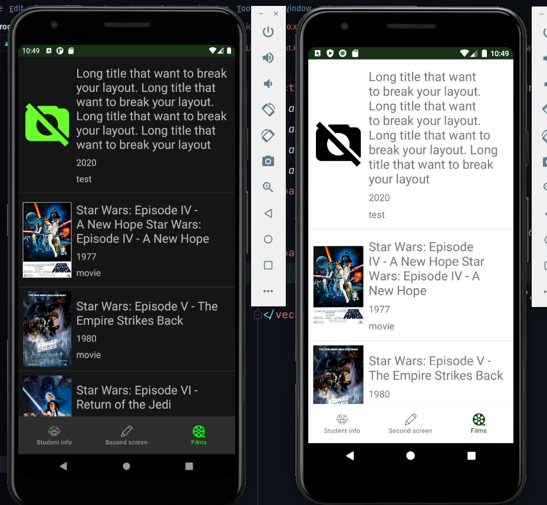
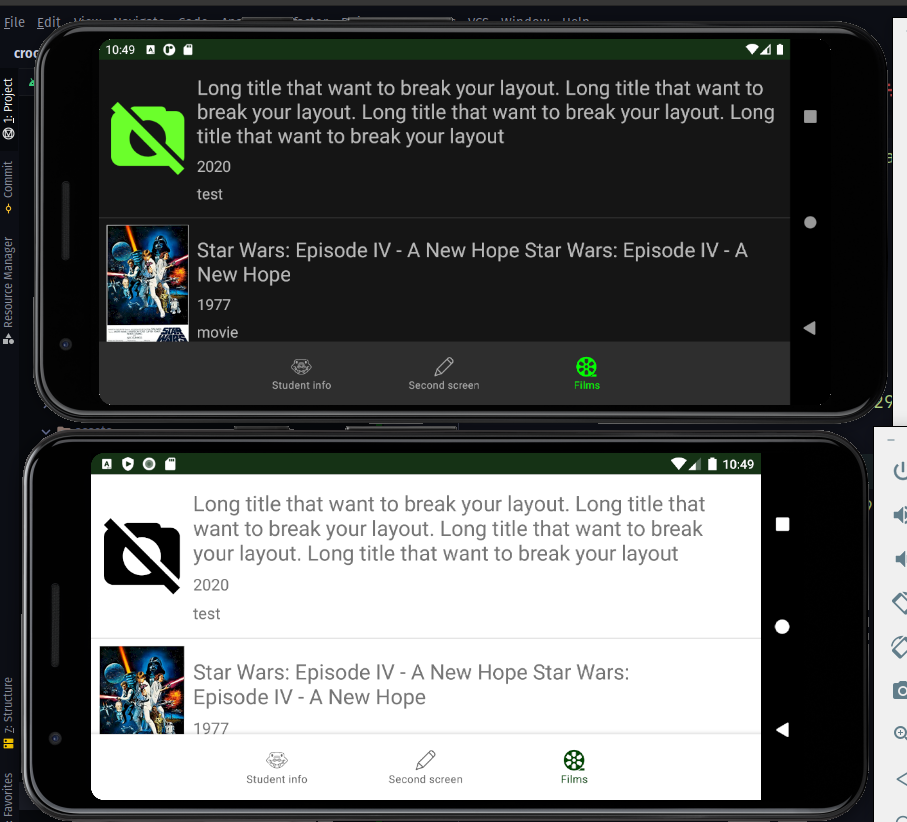

### НАЦІОНАЛЬНИЙ ТЕХНІЧНИЙ УНІВЕРСИТЕТ УКРАЇНИ "КИЇВСЬКИЙ ПОЛІТЕХНІЧНИЙ ІНСТИТУТ ІМЕНІ ІГОРЯ СІКОРСЬКОГО" Факультет інформатики та обчислювальної техніки Кафедра обчислювальної техніки

## Лабораторна робота №3
з дисципліни
### "Розроблення клієнтських додатків для мобільних платформ"

__Виконав__: 
студент групи ІП-84 
ЗК ІП-8410 
Ковалишин Олег

Київ 2021

__Варіант 8410 mod 2 + 1 = 1__

## Скріншоти роботи додатку
Автоматична темна тема на Android 10+

P. S. На gif на темній темі видно баги записувальної програми, а не додатка

## Лістинг коду
Увесь код можна знайти в репозиторії.
Фрагмент відображення фільмів реалізовано у модулі [feature-films](feature-films)

Основні файли:
* [Файли розмітки](feature-films/src/main/res);
* [Модель Film](feature-films/src/main/java/ua/kpi/comsys/ip8410/feature_films/core/domain/model/Film.kt)
* [Абстракція доступу до даних FilmDataSource](feature-films/src/main/java/ua/kpi/comsys/ip8410/feature_films/core/datasource/FilmDataSource.kt) та її [реалізація](feature-films/src/main/java/ua/kpi/comsys/ip8410/feature_films/data/datasource/local/FilmsAssetsDataSource.kt).
* [Адаптер спискового відображення FilmAdapter](feature-films/src/main/java/ua/kpi/comsys/ip8410/feature_films/ui/recycler/FilmAdapter.kt)
* [Фрагмент відображення фільмів FilmListFragment](feature-films/src/main/java/ua/kpi/comsys/ip8410/feature_films/ui/FilmListFragment.kt)

Під час розробки використовуються підходи View Binding, Single Activity App, MVVM.

## Висновок
Розроблено додаток відповідно до вимог лабораторної роботи.

Зібраний інсталяційний файл додатку можна знайти в [артефактах збірки](https://github.com/ALEGATOR1209/MobileLabs/actions).