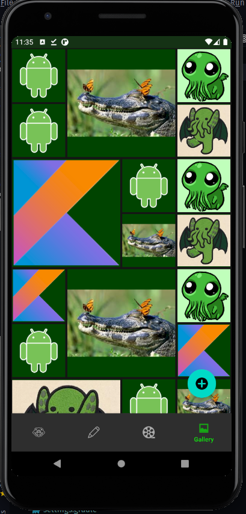
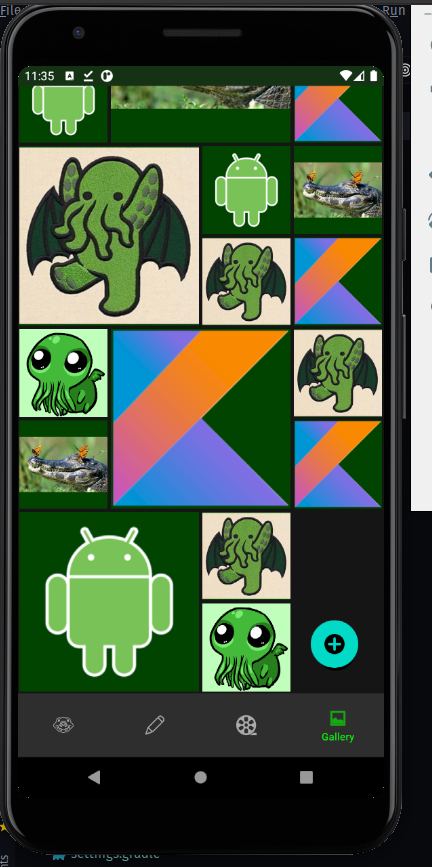
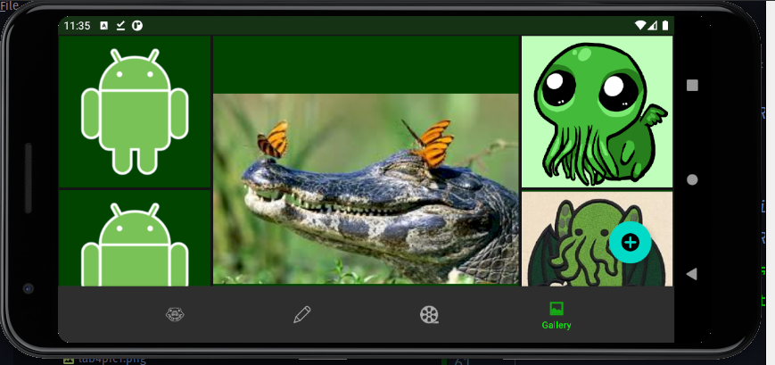
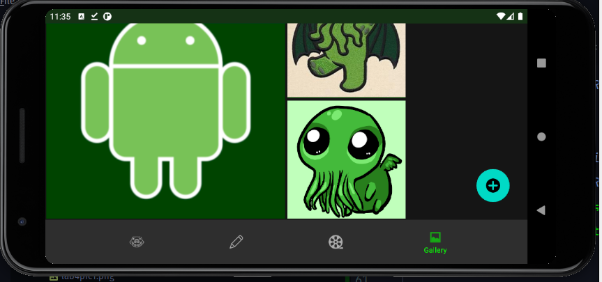

### НАЦІОНАЛЬНИЙ ТЕХНІЧНИЙ УНІВЕРСИТЕТ УКРАЇНИ "КИЇВСЬКИЙ ПОЛІТЕХНІЧНИЙ ІНСТИТУТ ІМЕНІ ІГОРЯ СІКОРСЬКОГО" Факультет інформатики та обчислювальної техніки Кафедра обчислювальної техніки

## Лабораторна робота №4
з дисципліни
### "Розроблення клієнтських додатків для мобільних платформ"

__Виконав__: 
студент групи ІП-84 
ЗК ІП-8410 
Ковалишин Олег

Київ 2021

__Варіант 8410 mod 6 + 1 = 5__

## Скріншоти роботи додатку

## Лістинг коду
Увесь код можна знайти в репозиторії.
Фрагмент галереї реалізовано у модулі [feature-gallery](feature-gallery)

Основні файли:
* [Файли розмітки](feature-gallery/src/main/res);
* [Фрагмент GalleryFragment](feature-gallery/src/main/java/ua/kpi/comsys/ip8410/feature_gallery/ui/GalleryFragment.kt);
* [Адаптер списку картинок PhotoAdapter](feature-gallery/src/main/java/ua/kpi/comsys/ip8410/feature_gallery/ui/adapter/PhotoAdapter.kt);
* [Менеджер розміщення картинок GalleryLayoutManager](feature-gallery/src/main/java/ua/kpi/comsys/ip8410/feature_gallery/ui/adapter/GalleryLayoutManager.kt);

Під час розробки використовуються підходи View Binding, Single Activity App, MVVM.

## Висновок
Розроблено додаток відповідно до вимог лабораторної роботи.

Зібраний інсталяційний файл додатку можна знайти в [артефактах збірки](https://github.com/ALEGATOR1209/MobileLabs/actions).
