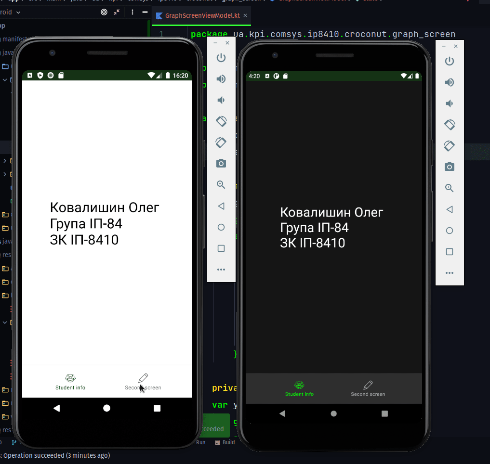

### НАЦІОНАЛЬНИЙ ТЕХНІЧНИЙ УНІВЕРСИТЕТ УКРАЇНИ "КИЇВСЬКИЙ ПОЛІТЕХНІЧНИЙ ІНСТИТУТ ІМЕНІ ІГОРЯ СІКОРСЬКОГО" Факультет інформатики та обчислювальної техніки Кафедра обчислювальної техніки

## Лабораторна робота №2
з дисципліни
### "Розроблення клієнтських додатків для мобільних платформ"

__Виконав__: 
студент групи ІП-84 
ЗК ІП-8410 
Ковалишин Олег

Київ 2021

__Варіант 8410 mod 6 + 1 = 5__

### Скріншоти роботи додатку
Автоматична темна тема на Android 10+

P. S. На gif на темній темі видно баги записувальної програми, а не додатка

### Лістинг коду
Увесь код можна знайти в репозиторії. Основні файли:

* [Файли розмітки](app/src/main/res), зокрема [фрагмент другого екрану](app/src/main/res/layout/fragment_graph_screen.xml)
* [Код відображення](app/src/main/java/ua/kpi/comsys/ip8410/croconut), зокрема [фрагмент другого крану](app/src/main/java/ua/kpi/comsys/ip8410/croconut/graph_screen/GraphScreenFragment.kt), [GraphView](app/src/main/java/ua/kpi/comsys/ip8410/croconut/graph_screen/views/GraphView.kt), [ChartView](app/src/main/java/ua/kpi/comsys/ip8410/croconut/graph_screen/views/ChartView.kt)

Під час розробки використовуються підходи View Binding, Single Activity App, MVVM.

### Висновок
Розроблено додаток відповідно до вимог лабораторної роботи.

Зібраний інсталяційний файл додатку можна знайти в [артефактах збірки](https://github.com/ALEGATOR1209/MobileLabs/actions).